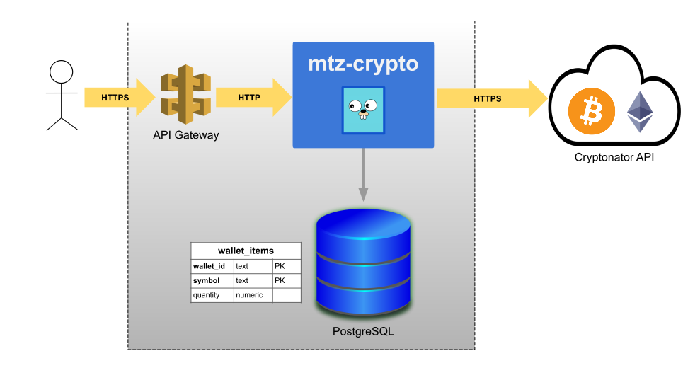
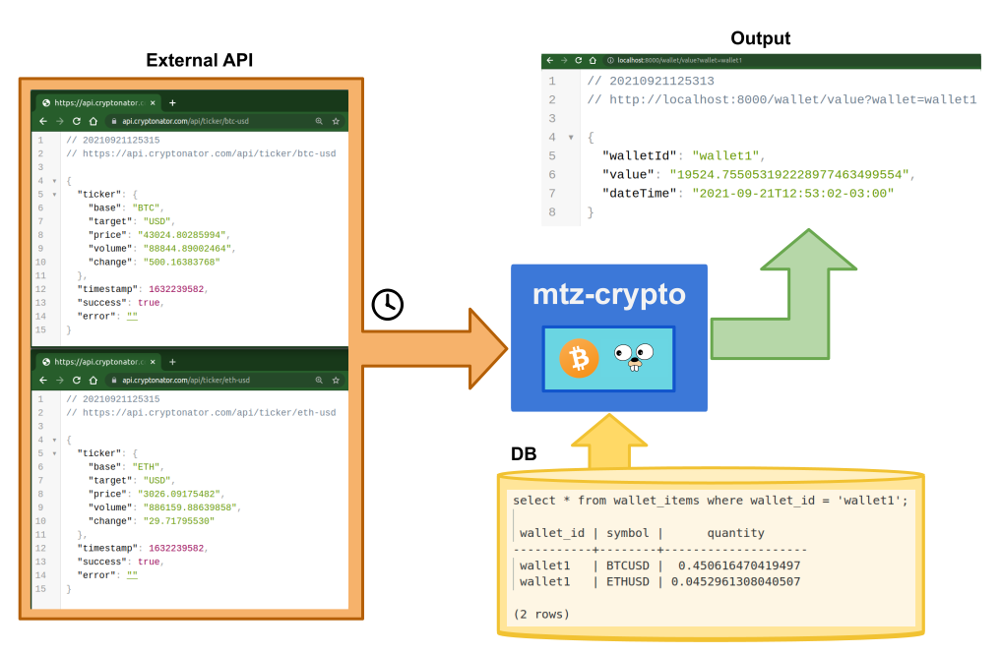
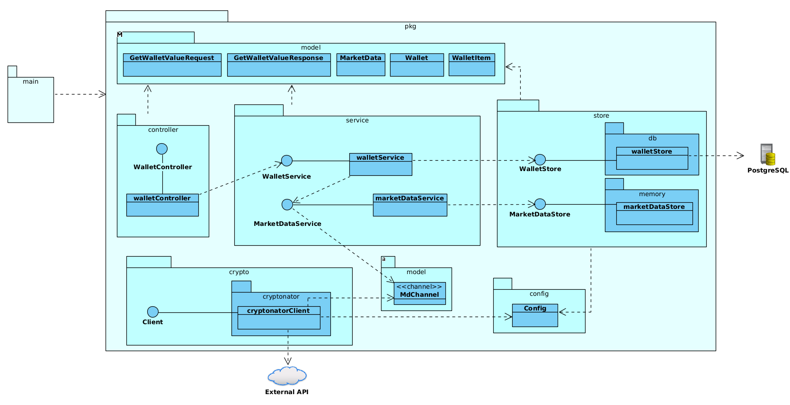

# mtz-crypto

Servicio de ejemplo para capacitación Go

## Descripción

Esta aplicación consulta periódicamente el precio de criptoactivos a una API
externa, y calcula el valor total de una billetera crypto en cada request.

La composición de las billeteras se almacena en PostgreSQL.

La aplicación está diseñada para ser desplegada como microservicio
interno. Es decir, no expuesta directamente a usuarios finales sino
a través de otro sistema o un API gateway: no realiza autenticación
ni autorización de requests.

## Arquitectura

## Flujo de datos

## Diseño

## Tecnología empleada / librerías

- HTTP Server: [gin](https://github.com/gin-gonic/gin)
- Cache en memoria: [go-cache](https://github.com/patrickmn/go-cache)
- Configuración: [viper](https://github.com/spf13/viper)
- Acceso a base de datos: [gorm](https://github.com/go-gorm/gorm)
- Métricas: [go-gin-prometheus](https://github.com/zsais/go-gin-prometheus)
- Logging: [zap](https://github.com/uber-go/zap)
- Arbitrary-precision fixed-point decimal numbers: [decimal](https://github.com/shopspring/decimal)
- Tests automáticos y mocks: [testify](https://github.com/stretchr/testify)
- HTTP Benchmarking tool: [h2load](https://nghttp2.org/documentation/h2load-howto.html)
- [Docker](https://docs.docker.com/) y [Docker compose](https://docs.docker.com/compose/)

## Links útiles

- [Instalación de Go](https://golang.org/doc/install)
- [Visual Studio Code (IDE)](https://code.visualstudio.com/)
- [Instalación de Docker](https://docs.docker.com/get-docker/)
- [Instalación de Docker Compose](https://docs.docker.com/compose/install/)
- [VSCode Go extension](https://marketplace.visualstudio.com/items?itemName=golang.go)
- [Documentación de Go](https://golang.org/doc/)
- [pkg.go.dev](https://pkg.go.dev/)
- [Gitlab CI config](https://docs.gitlab.com/ce/ci/quick_start/)
